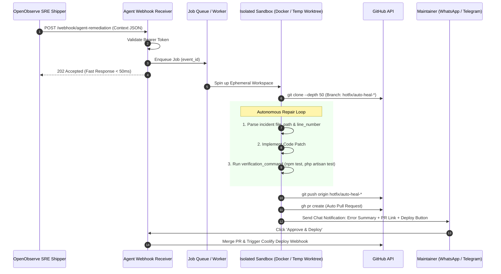

# 🤖 Coding Agent Environment Setup Guide (Best Practices)

This guide provides technical best practices for provisioning an execution environment for an **Autonomous Coding Agent** to securely ingest, process, and remediate production incidents dispatched by **`openobserve-sre`**.

---

## 🏛️ Ingestion & Remediation Lifecycle

The Coding Agent operates as an autonomous, asynchronous worker decoupled from the monitoring stack:



---

## 🛡️ 6 Core Architectural Best Practices

### 1. Fast Acknowledgment via Job Queue
* **Golden Rule:** Never execute code repair loops directly within the synchronous webhook HTTP request lifecycle.
* The webhook receiver should validate `Authorization: Bearer <TOKEN>`, enqueue the task into a background worker (e.g., Celery, BullMQ, or Tokio task), and return an immediate `202 Accepted` within 50ms to prevent connection timeouts from the Shipper.

### 2. Ephemeral Sandbox Isolation
> [!CAUTION]
> **NEVER** allow an autonomous agent to execute directly in the live production application directory. Failed patches, untrusted dependencies, or test runs that modify databases can cause catastrophic downtime.

Use one of two recommended isolation models:
* **Approach A (Temporary Workspace / Git Worktree - Fast):**
  Create an isolated scratch directory per incident:
  ```bash
  mkdir -p /tmp/workspaces/evt_123
  git clone --depth 50 https://github.com/myorg/toko-online-api /tmp/workspaces/evt_123
  cd /tmp/workspaces/evt_123
  git checkout -b hotfix/auto-heal-evt_123
  ```
* **Approach B (Ephemeral Docker Containers - Maximum Isolation):**
  Spin up a disposable container with the required language runtime (`php:8.3-cli`, `node:20-alpine`, `python:3.12-slim`). Destroy the container upon job completion (`--rm`).

### 3. Dependency Cache Mounting
* Downloading dependencies (`node_modules`, `vendor/`, `pip cache`) over the internet during every incident wastes bandwidth and adds minutes to recovery time.
* Mount global host cache directories into the agent workspace:
  - PHP: `~/.composer/cache`
  - Node.js: `~/.pnpm-store` or `~/.npm`
  - Python: `~/.cache/pip`
  - Go: `~/go/pkg/mod`
* *Result:* Dependency installation and test verification complete in **under 10 seconds**.

### 4. Dedicated Git Bot Identity
Configure automated commits with a dedicated bot persona:
```bash
git config user.name "SRE Auto-Heal Bot"
git config user.email "auto-heal-bot@users.noreply.github.com"
```

### 5. Automated Verification & Retry Loop
The JSON payload provided by `openobserve-sre` includes `remediation_instructions.verification_command`:
1. The agent inspects `incident.file_path` at `incident.line_number`.
2. The agent applies a targeted patch (null checks, defensive type handling, boundary validation).
3. The agent executes the specified verification command (e.g., `php artisan test` or `npm test`).
4. **Retry Circuit:** If tests fail, the agent reads test failure logs and iterates (up to 3 attempts). If tests still fail after 3 rounds, abort PR creation and trigger a human alert.

### 6. Human-in-the-Loop Release Gate (1-Tap Approval)
* The agent pushes the fix branch and opens a Pull Request using the GitHub CLI (`gh pr create`).
* An interactive message is delivered to your designated chat channel:
  ```text
  🚨 [Auto-Heal Ready for Review]
  App: pos-kasir (Coolify)
  Error: Cannot read properties of undefined (reading 'rate')
  File: src/services/currency.ts:42

  🤖 Investigation & Fix Summary:
  - Root cause: Currency rate API timeout left rate variable undefined.
  - Patch: Added nullish coalescing default value with cache fallback.
  - Test Suite: 16 passed, 0 failed ✅
  - PR: https://github.com/myorg/pos-kasir/pull/104

  👉 Quick Actions:
  [1] Approve & Deploy to Production
  [2] Ignore / Close PR
  ```
* Tapping `[Approve]` triggers PR merge and fires the **Coolify Deploy Webhook** (`POST https://coolify.../api/v1/deploy?uuid=...`).

---

## 💻 Sample Webhook Receiver Implementation (Python FastAPI)

Below is a reference starter service that can be hosted on your agent server to receive payloads from `openobserve-sre`:

```python
import os
import subprocess
from fastapi import FastAPI, Header, HTTPException, BackgroundTasks
from typing import Dict, Any

app = FastAPI(title="Coding Agent Remediation Receiver")
EXPECTED_TOKEN = os.getenv("AGENT_AUTH_TOKEN", "")

def run_agent_remediation(payload: Dict[str, Any]):
    event_id = payload["event_id"]
    app_meta = payload["app_metadata"]
    incident = payload["incident"]
    repo_url = app_meta["repository"]["url"]
    target_branch = app_meta["repository"]["target_branch"]
    workspace_dir = f"/tmp/workspaces/{event_id}"

    try:
        # 1. Clone repository in an isolated workspace
        subprocess.run(["git", "clone", "--depth", "50", repo_url, workspace_dir], check=True)
        subprocess.run(["git", "checkout", "-b", target_branch], cwd=workspace_dir, check=True)

        # 2. Invoke Autonomous Coding Agent CLI
        prompt = f"""
        Fix {incident['error_type']} in file {incident['file_path']} at line {incident['line_number']}.
        Error Message: {incident['error_message']}
        Verification Command: {payload['remediation_instructions']['verification_command']}
        Ensure all test suites pass!
        """
        
        # Execute agent runner inside workspace
        subprocess.run(["your-agent-cli", "--prompt", prompt], cwd=workspace_dir, check=True)

        # 3. Push branch and open Pull Request
        subprocess.run(["git", "push", "origin", target_branch], cwd=workspace_dir, check=True)
        subprocess.run(
            ["gh", "pr", "create", 
             "--title", f"fix(auto-heal): resolve {incident['error_type']} in {incident['file_path']}", 
             "--body", f"Automated hotfix generated by SRE Agent for event `{event_id}`."],
            cwd=workspace_dir, 
            check=True
        )

    finally:
        # 4. Clean up ephemeral workspace
        subprocess.run(["rm", "-rf", workspace_dir])

@app.post("/webhook/agent-remediation")
async def receive_incident(
    payload: Dict[str, Any],
    background_tasks: BackgroundTasks,
    authorization: str = Header(None)
):
    if EXPECTED_TOKEN and authorization != f"Bearer {EXPECTED_TOKEN}":
        raise HTTPException(status_code=401, detail="Unauthorized")

    background_tasks.add_task(run_agent_remediation, payload)

    return {
        "status": "queued",
        "event_id": payload.get("event_id"),
        "message": "Incident queued for autonomous agent remediation."
    }
```
