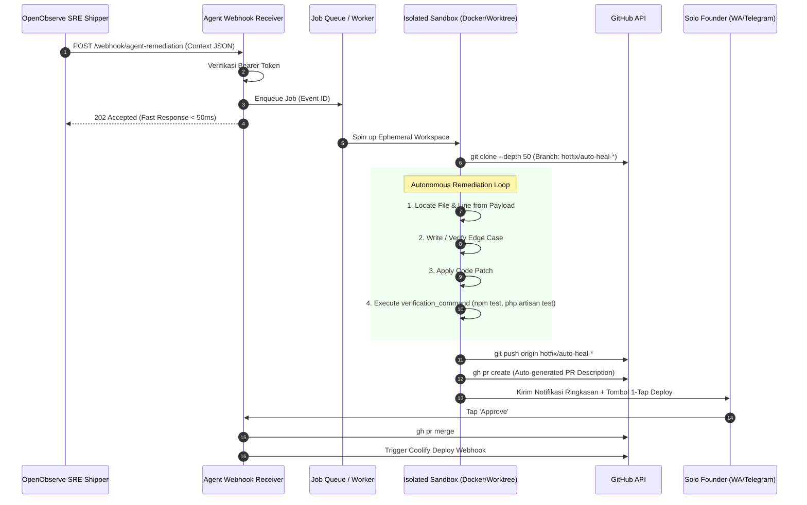

# 🤖 Panduan Setup Environment Coding Agent (Best Practices)

Dokumen ini menjelaskan bagaimana menyiapkan *environment* dan *runtime* untuk **Coding Agent** agar dapat menerima, memproses, dan menyelesaikan insiden yang dikirimkan oleh **`openobserve-sre`** secara aman, cepat, dan otomatis.

---

## 🏛️ Arsitektur Penerimaan & Eksekusi Agent

Coding Agent bertindak sebagai "mekanik". Sistem ini bekerja secara *asynchronous* dan terisolasi:



---

## 🛡️ 6 Prinsip Utama Setup Environment (Best Practices)

### 1. Fast Acknowledgment via Job Queue
* **JANGAN** memproses perbaikan kode langsung di dalam HTTP request handler webhook.
* Webhook handler harus segera merespons `202 Accepted` dalam tempo < 50ms setelah memvalidasi Bearer Token.
* Proses kloning, perbaikan kode, dan testing dijalankan di background worker (misal: Celery, BullMQ, atau Tokio task).

### 2. Workspace Terisolasi (Ephemeral Sandbox)
> [!CAUTION]
> **JANGAN PERNAH** menjalankan Coding Agent di direktori aplikasi yang sedang *live* di server produksi! Perubahan kode yang gagal atau eksekusi test yang merusak database bisa melumpuhkan sistem.

Gunakan salah satu dari dua pendekatan:
* **Pendekatan A (Git Worktree / Temp Dir - Ringan):**
  Buat folder sementara di `/tmp/workspaces/<event_id>`:
  ```bash
  mkdir -p /tmp/workspaces/evt_123
  git clone --depth 50 https://github.com/myorg/toko-online-api /tmp/workspaces/evt_123
  cd /tmp/workspaces/evt_123
  git checkout -b hotfix/auto-heal-evt_123
  ```
* **Pendekatan B (Ephemeral Docker Container - Paling Aman):**
  Jalankan agent di dalam container Docker sekali-pakai (*disposable container*) yang memiliki runtime bahasa terkait (PHP, Node.js, Python, atau Go). Setelah selesai, container otomatis di-*destroy* (`--rm`).

### 3. Caching Dependensi untuk Kecepatan
* Agar siklus auto-heal selesai dalam **< 2 menit**, agent tidak boleh mengunduh ulang ribuan dependensi (`node_modules`, `vendor/`, `pip cache`) dari internet setiap kali insiden terjadi.
* Mount direktori cache global host ke dalam sandbox:
  - Composer: `~/.composer/cache`
  - NPM / PNPM: `~/.pnpm-store` atau `~/.npm`
  - PIP: `~/.cache/pip`
  - Go: `~/go/pkg/mod`

### 4. Git Identity Khusus Bot
Atur identitas commit agar terpisah dari commit personal Anda:
```bash
git config user.name "SRE Auto-Heal Bot"
git config user.email "auto-heal-bot@users.noreply.github.com"
```

### 5. Loop Verifikasi Otomatis (Max 3 Percobaan)
Konteks JSON dari `openobserve-sre` menyertakan `remediation_instructions.verification_command`:
1. Agent membaca perintah tes (contoh: `npm test` atau `php artisan test`).
2. Setelah menerapkan *patch*, agent menjalankan perintah tes tersebut.
3. **Jika tes GAGAL:** Agent membaca output error pengujian, memperbaiki kode kembali, dan mencoba ulang (maksimal 3 *retry*).
4. **Jika 3 kali tetap gagal:** Agent membatalkan pembuatan PR dan mengirim notifikasi peringatan: *"Agent tidak dapat memverifikasi perbaikan secara mandiri; membutuhkan intervensi manual."*

### 6. Human-in-the-Loop Gateway (1-Tap WhatsApp/Telegram)
Agent membuka Pull Request di GitHub dan mengirim pesan ringkas ke aplikasi chat Anda:
```text
🚨 [Auto-Heal Ready for Review]
Aplikasi: pos-kasir (Coolify)
Error: Cannot read properties of undefined (reading 'rate')
File: src/services/currency.ts:42

🤖 Hasil Investigasi:
- Root cause: API kurs mata uang timeout, variabel rate bernilai undefined.
- Patch: Menambahkan nullish coalescing dan fallback cache rate.
- Tests: 16 passed, 0 failed ✅
- PR: https://github.com/myorg/pos-kasir/pull/104

👉 Aksi Cepat:
[1] Approve & Deploy ke Production
[2] Abaikan
```

---

## 💻 Contoh Implementasi Sederhana Webhook Receiver (Python FastAPI)

Berikut adalah skeleton service mandiri yang dapat Anda deploy di server agent Anda untuk menerima payload dari `openobserve-sre`:

```python
import os
import subprocess
from fastapi import FastAPI, Header, HTTPException, BackgroundTasks
from pydantic import BaseModel
from typing import Dict, Any

app = FastAPI(title="Coding Agent Remediation Receiver")
EXPECTED_TOKEN = os.getenv("AGENT_AUTH_TOKEN", "")

def run_agent_remediation(payload: Dict[str, Any]):
    event_id = payload["event_id"]
    app_meta = payload["app_metadata"]
    incident = payload["incident"]
    repo_url = app_meta["repository"]["url"]
    target_branch = app_meta["repository"]["target_branch"]
    workspace_dir = f"/tmp/workspaces/{event_id}"

    try:
        # 1. Clone repo di workspace terisolasi
        subprocess.run(["git", "clone", "--depth", "50", repo_url, workspace_dir], check=True)
        subprocess.run(["git", "checkout", "-b", target_branch], cwd=workspace_dir, check=True)

        # 2. Panggil Coding Agent CLI (misal: Antigravity CLI, Claude Code, Aider, atau custom script)
        prompt = f"""
        Perbaiki error {incident['error_type']} pada file {incident['file_path']} baris {incident['line_number']}.
        Pesan Error: {incident['error_message']}
        Setelah memperbaiki, jalankan perintah verifikasi: {payload['remediation_instructions']['verification_command']}
        Pastikan seluruh tes lolos!
        """
        
        # Eksekusi agent di dalam workspace
        subprocess.run(["your-coding-agent-cli", "--prompt", prompt], cwd=workspace_dir, check=True)

        # 3. Push branch dan buat Pull Request
        subprocess.run(["git", "push", "origin", target_branch], cwd=workspace_dir, check=True)
        subprocess.run(["gh", "pr", "create", "--title", f"fix(auto-heal): resolve {incident['error_type']} in {incident['file_path']}", "--body", "Auto-generated hotfix by SRE Agent."], cwd=workspace_dir, check=True)

    finally:
        # Cleanup workspace setelah selesai
        subprocess.run(["rm", "-rf", workspace_dir])

@app.post("/webhook/agent-remediation")
async def receive_incident(
    payload: Dict[str, Any],
    background_tasks: BackgroundTasks,
    authorization: str = Header(None)
):
    # Validasi autentikasi
    if EXPECTED_TOKEN and authorization != f"Bearer {EXPECTED_TOKEN}":
        raise HTTPException(status_code=401, detail="Unauthorized")

    # Jalankan remediator di background
    background_tasks.add_task(run_agent_remediation, payload)

    return {
        "status": "queued",
        "event_id": payload.get("event_id"),
        "message": "Incident queued for autonomous agent remediation."
    }
```
