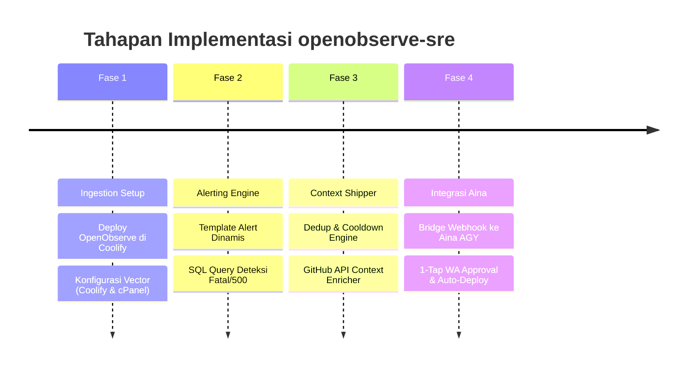

# 🗺️ Roadmap Implementasi: OpenObserve SRE Hub

Roadmap ini berfokus pada pembangunan **Sensor & Observability Hub (`openobserve-sre`)** dan integrasinya dengan **Aina** sebagai konsumer Coding Agent utama secara *agent-agnostic*.

---

## 📅 Roadmap Tahapan Proyek

---

## 🛠️ Rincian Checklist Implementasi

### Fase 1: Setup OpenObserve & Zero-Touch Collectors (Hari 1)
* [ ] Jalankan OpenObserve menggunakan `docker-compose.yml` di Coolify / Docker VPS.
* [ ] Pasang Vector di Coolify menggunakan `collectors/vector-coolify.yaml` (membaca `/var/run/docker.sock`).
* [ ] Pasang Vector/FluentBit di cPanel menggunakan `collectors/vector-cpanel.yaml` (tailing `error_log`).
* [ ] Uji kirim log dari minimal 2 aplikasi berbeda dan pastikan data muncul di dashboard OpenObserve.

### Fase 2: Aturan Deteksi & Template Alert (Hari 2)
* [ ] Buat Stream Template di OpenObserve (`alerts/alert-template.json`) yang menyertakan placeholder `{alert_name}`, `{stream_name}`, dan `{rows:5}`.
* [ ] Daftarkan SQL Alert untuk deteksi insiden:
  - `alerts/php-fatal-errors.sql`: Menangkap Fatal Error, Uncaught Exception, dan Syntax Error di PHP/cPanel.
  - `alerts/nodejs-unhandled.sql`: Menangkap UnhandledPromiseRejection, uncaughtException, dan 500 error di Node/Python/Go.
* [ ] Verifikasi webhook OpenObserve berhasil menembak endpoint lokal / webhook tester.

### Fase 3: Pembangunan Context Shipper & Deduplicator (Hari 3)
* [ ] Buat service ringan di `shipper/main.py` (FastAPI / Python):
  - Menerima webhook alert dari OpenObserve.
  - Menghitung signature hash insiden `hash(app + file + line + error)`.
  - Menerapkan cooldown 30 menit untuk mencegah banjir token dan duplikasi.
  - Membaca metadata aplikasi dari `shipper/config.yaml` (mapping nama aplikasi ke URL GitHub dan branch default).
  - Mengambil cuplikan kode dari GitHub API (20 baris sebelum dan sesudah baris error).
  - Merakit JSON payload terstandar sesuai [docs/CONTEXT_SPEC.md](CONTEXT_SPEC.md).

### Fase 4: Integrasi Agent-Agnostic ke Aina & Human-in-the-Loop (Hari 4)
* [ ] Arahkan output Shipper ke endpoint Aina (via AGY webhook runner / custom agent trigger).
* [ ] Uji coba skenario insiden tiruan (simulasi bug sederhana):
  1. Trigger error buatan di salah satu app test.
  2. OpenObserve menangkap error dalam < 15 detik.
  3. Shipper merakit payload dan memicu Aina.
  4. Aina meng-clone branch hotfix, membuat perbaikan, menjalankan test, dan membuka PR di GitHub.
  5. Notifikasi interaktif masuk ke WhatsApp/Telegram.
* [ ] Hubungkan aksi konfirmasi `[Approve]` ke Coolify Deploy Webhook atau Git pull hook cPanel.

---

## 🎯 Definisi Keberhasilan (Done Criteria)
1. **Zero Code Changes:** 20+ aplikasi di cPanel dan Coolify terhubung ke observabilitas tanpa mengubah satu baris pun kode pada aplikasi tersebut.
2. **Standardized Context:** Payload insiden yang dihasilkan bersifat *agent-agnostic* dan siap dieksekusi oleh Aina maupun agen coding lainnya.
3. **No Duplicate Invocations:** Tidak terjadi pemanggilan agen berulang untuk error yang identik dalam kurun waktu 30 menit.
