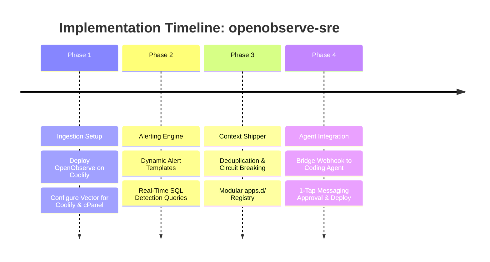

# 🗺️ Implementation Roadmap: OpenObserve SRE Hub

This roadmap outlines the phased implementation of the **`openobserve-sre` Telemetry Gateway** and its integration with external **Autonomous Coding Agents** in an agent-agnostic manner.

---

## 📅 Roadmap Overview

---

## 🛠️ Phase-by-Phase Checklist

### Phase 1: Setup OpenObserve & Zero-Touch Collectors (Day 1)
* [ ] Deploy OpenObserve using `docker-compose.yml` on Coolify or a standalone Docker host.
* [ ] Deploy Vector on Coolify using `collectors/vector-coolify.yaml` (streaming from `/var/run/docker.sock`).
* [ ] Deploy Vector/FluentBit on cPanel using `collectors/vector-cpanel.yaml` (tailing `error_log`).
* [ ] Verify that logs from at least two sample applications appear in the OpenObserve web UI.

### Phase 2: Detection Rules & Alert Templates (Day 2)
* [ ] Create an Alert Webhook Template in OpenObserve (`alerts/openobserve-template.json`) including placeholders: `{alert_name}`, `{stream_name}`, and `{rows:5}`.
* [ ] Register SQL alerts for production incident detection:
  - `alerts/php-fatal-errors.sql`: Detects Fatal Errors, Uncaught Exceptions, and Parse Errors across PHP/cPanel applications.
  - `alerts/nodejs-unhandled.sql`: Detects UnhandledPromiseRejections, uncaughtExceptions, and 5xx spikes in Node.js, Python, and Go containers.
* [ ] Verify webhook delivery using a local test listener or request bin.

### Phase 3: Context Shipper & Modular Registry (Day 3)
* [ ] Compile and deploy the Rust service in `shipper/`:
  - Receives alerts from OpenObserve via HTTP POST.
  - Generates incident signature hashes: `hash(app + file + line + error)`.
  - Enforces a 30-minute cooldown window to eliminate duplicate agent runs.
  - Dynamically scans application definitions from `apps.d/*.yaml`.
  - Assembles standardized JSON payloads conforming to [docs/CONTEXT_SPEC.md](CONTEXT_SPEC.md).

### Phase 4: Agent Integration & Human-in-the-Loop Gate (Day 4)
* [ ] Direct Shipper webhook output to your designated Coding Agent runner (`AGENT_TARGET_URL`).
* [ ] Run an end-to-end incident drill:
  1. Trigger an intentional test exception on a monitored application.
  2. OpenObserve detects the error in < 15 seconds.
  3. The Rust Shipper deduplicates and packages the incident context.
  4. The Coding Agent checks out an isolated hotfix branch, applies a fix, runs test verification, and opens a Pull Request.
  5. An interactive message with PR link arrives on WhatsApp or Telegram.
* [ ] Connect the `[Approve]` action to the Coolify Deploy Webhook or cPanel Git deployment hook.

---

## 🎯 Definition of Done
1. **Zero Code Changes:** 20+ production services in cPanel and Coolify are monitored without modifying target application source code.
2. **Standardized Context:** Incident payloads are completely agent-agnostic and actionable by any autonomous coding agent.
3. **No Duplicate Invocations:** Identical errors within a 30-minute window are throttled to conserve LLM token budgets.
